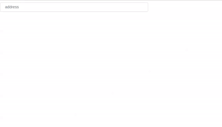

# AngularJS - Address Autosuggest (Google Maps Places API)

An AngularJS based Address component which uses Google Maps Places API to autosuggest location address.

## Table of contents

- [Browser Support](#browser-support)
- [Demo](#demo)
- [Installation](#installlation)
- [Getting started](#getting-started)
- [Usage](#usage)
- [Available Props](#available-props)
- [Methods](#methods)
- [Want to Contribute?](#want-to-contribute)
- [Collection of Components](#collection-of-components)
- [Changelog](#changelog)
- [Credits](#credits)
- [License](#license)
- [Keywords](#Keywords)

## Browser Support

|  |  |  |  |  |
| ---------------------------------------------------------------------------------------- | ------------------------------------------------------------------------------------------- | ---------------------------------------------------------------------------------------- | ---------------------------------------------------------------------------------- | ---------------------------------------------------------------------------------------------------------------------------- |
| 83.0 ✔                                                                                   | 77.0 ✔                                                                                      | 13.1.1 ✔                                                                                 | 83.0 ✔                                                                             | 11.9 ✔                                                                                                                       |

## Demo

[](https://github.com/weblineindia/AngularJS-Address-Autosuggest/addressNg.gif)

## Installation

This component uses Google Maps Places API to get geo suggestions for address autocompletion. To use this component, you have to include the Google Maps Places API in the `<head>` of your HTML:

```html
<!DOCTYPE html>
<html>
  <head>
    …
    <script src="https://maps.googleapis.com/maps/api/js?key=YOUR_API_KEY_HERE&libraries=places"></script>
  </head>
  <body>
    …
  </body>
</html>
```

To obtain API key please visit the [Google Developer Console](https://console.developers.google.com). The API's that you have to enable in your Google API Manager Dashboard are [Google Maps Geocoding API](https://developers.google.com/maps/documentation/geocoding/start), [Google Places API Web Service](https://developers.google.com/places/web-service/) and [Google Maps Javascript API](https://developers.google.com/maps/documentation/javascript/).

## Getting started

Install the npm package:

```bash
npm install angular-weblineindia-address
#OR
yarn add angular-weblineindia-address
```

## Usage

Use the `<angular-weblineindia-address>` component:
Add in app.module.ts

```ts
import {AddressModule} from 'angular-weblineindia-address'

 imports: [
    AddressModule
  ],

```

Add in app.component.ts

```ts
import { Component } from "@angular/core";

@Component({
  selector: "app-root",
  templateUrl: "./app.component.html",
  styleUrls: ["./app.component.css"]
})
export class AppComponent {
  adddressValue: any = [{ address: "" }];

  address: any = {
    placeholder: "address",
    addressUniqueErrorMsg: "Please do not enter same address",
    addressOptions: {
      types: [],
      componentRestrictions: { country: "IN" }
    },
    maxlength: 50,
    name: "address",
    id: "address",
    disabled: false,
    tabindex: 0
  };

  handleAddressChange(event) {
    this.adddressValue.push(event.data);
  }

  onChangeAddress(event) {
    this.adddressValue[event.index].address = event.data;
  }

  onBlurAddress(data) {}

  onFocusAddress(data) {}

  onClickPlus() {
    this.adddressValue.push({ address: "" });
  }
}
```

Add in app.component.html

```html
<div *ngFor="let value of adddressValue;let indexOfelement=index;">
  <lib-address
    [addressValue]="value.address"
    [index]="indexOfelement"
    [addressArray]="adddressValue"
    [isShowPlus]="adddressValue.length-1 === indexOfelement"
    [placeholder]="address.placeholder"
    [addressUniqueErrorMsg]="address.addressUniqueErrorMsg"
    [addressOptions]="address.addressOptions"
    [maxlength]="address.maxlength"
    [name]="address.name"
    [id]="address.id"
    [disabled]="address.disabled"
    [tabindex]="address.tabindex"
    (changeAddress)="onChangeAddress($event)"
    (onPlus)="onClickPlus()"
    (blur)="onBlurAddress($event)"
    (focus)="onFocusAddress($event)"
  ></lib-address>
</div>
```

## Available Props

| Prop                  | Type          | default                                                                                                                                                                       | Description                                    |
| --------------------- | ------------- | ----------------------------------------------------------------------------------------------------------------------------------------------------------------------------- | ---------------------------------------------- |
| id                    | String        |                                                                                                                                                                               | ID for the input container                     |
| name                  | String        |                                                                                                                                                                               | Name of the component                          |
| addressValue          | Array         | address: [ {address: "", geolocation: { x: 0, y: 0 }, country: "",locality: "",postalcode: "", state: "",province: "",fulladdress: "", streetaddress: "",isDuplicate: false}] | Value of the component                         |
| placeholder           | String        |                                                                                                                                                                               | The input field will get this placeholder text |
| disabled              | Boolean       | false                                                                                                                                                                         | Disable component                              |
| tabindex              | Number        |                                                                                                                                                                               | Tab index of the component                     |
| isMultiple            | Boolean       |                                                                                                                                                                               | Add Multiple Address                           |
| isShowPlus            | Boolean       |                                                                                                                                                                               | Show + icon                                    |
| index                 | Number        |                                                                                                                                                                               | Add key of the component                       |
| maxlength             | Number        |                                                                                                                                                                               | The input maxlength                            |
| addressArray          | Array[object] | []                                                                                                                                                                            | The address array                              |
| addressUniqueErrorMsg | String        |                                                                                                                                                                               | Unique address validation                      |
| addressOptions        | Object        |                                                                                                                                                                               | Autocomplete address options                   |

## Methods

| Name          | Description                                                      |
| ------------- | ---------------------------------------------------------------- |
| focus         | Gets triggered when the autocomplete input field receives focus. |
| blur          | Gets triggered when the autocomplete input field loses focus.    |
| onPlus        | Gets triggered every time when add plus icon                     |
| changeAddress | Gets triggered when the autocomplete results got changed.        |

## Want to Contribute?

- Created something awesome, made this code better, added some functionality, or whatever (this is the hardest part).
- [Fork it](http://help.github.com/forking/).
- Create new branch to contribute your changes.
- Commit all your changes to your branch.
- Submit a [pull request](http://help.github.com/pull-requests/).

---

## Collection of Components

We have built many other components and free resources for software development in various programming languages. Kindly click here to view our [Free Resources for Software Development](https://www.weblineindia.com/software-development-resources.html)

---

## Changelog

Detailed changes for each release are documented in [CHANGELOG.md](./CHANGELOG.md).

## Credits

angular-weblineindia-address is inspired by [ngx-google-places-autocomplete](https://www.npmjs.com/package/ngx-google-places-autocomplete).

## License

[MIT](LICENSE)

[mit]: https://github.com/weblineindia/AngularJS-Address-Autosuggest/blob/master/LICENSE

## Keywords

angular-weblineindia-address, address-autocomplete, google-maps-places, angular-components, angularjs, angularjs-component, angular-address-autosuggest, google-maps-places-api
